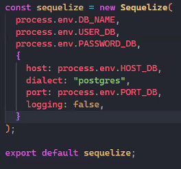

- [ ] Delete->transaction, devuelve null
- [ ] Updates en general, qué deben devolver?
- [ ]  Al borrar una cuenta debería borrar también las transacciones?
- [ ]  Get de transacción por cuenta
- [ ]  get de tipo de transacción para comprobar que existe
- [ ]  get de tipo de cuenta para comprobar que existe
- [ ]  Tipar bien los errores SQL
- [ ]  Algunos get devuelven null si no encuentran nada
- [ ]  Tipar req.usuario [text](../src/Middleware/jwt.middleware.ts)
- [ ]  Límite en el **token**, tiempo, cantidad de usos [text](../src/Utils/auth.util.ts)
- [ ]  Enviar **correo para validar email**? [text](../src/c_auth/auth.controller.ts)
- [ ]  Register entre otros en minúscula [text](../src/c_auth/auth.controller.ts)
- [ ] 🔎 Sqlite para guardar tokens? 


---
Hito5
- Agregar Roles?
- Guardar token en bd para tener la sesión?
  - Agregar campo en el schema
  - Guardar el token al registrar usuario
  - Guardar token al iniciar sesión
  - Validar token vigente desde la base de datos o que exista
  - Eliminar token al dormir usuario
- Incluir cookie de token





```ts
interface User{
  uid: string;
  name: string;
  email: string;
  password_hash: string;
  active: boolean;
}

interface AccountType{
  id_account_type: string;
  name: string;
  description?: string;
}

interface TransactionType{
  id_transaction_type: string;
  name: string;
  description?: string;
}

interface Account{
  id_account: string;
  id_user: User;
  name: string;
  id_account_type: AccountType;
  balance: number;
  credit_limit?: number;
  due_date: Date;
}

interface Transaction{
  id_transaction: string;
  id_user: User;
  id_account: Account;
  amount: number;
  id_transaction_type: TransactionType;
  description?: string;
  transaction_date: Date;
  
}
```