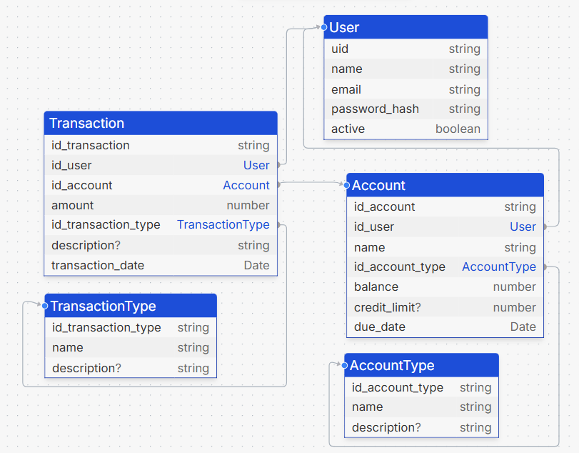

# BootcampJSFinanzas
<<<<<<< HEAD
 BootcampJSFinanzas
### Hito 1
Para evaluar el Hito1, favor ir a Documentacion>Evidencias.docx

### Hito 2
Para evaluar el Hito2, revisar las rutas y sus request de ejemplo. En la carpeta config estan las querys para comenzar.
No estan los insert de lo que se puede agregar por request. 
El paso Optimo seria:
Crear usuario Login con auth,
Crear cuenta con account,
Crear Transaccion con transaction
Desde ahi se pueden manipular todos los datos.
=======

## Hito 1
Para evaluar el Hito1, favor ir a Documentacion>Evidencias.docx

## Hito 2
Para evaluar el Hito2, revisar las rutas y sus request de ejemplo. En la carpeta config estan las querys para comenzar. No estan los insert de lo que se puede agregar por request. El paso Optimo seria: Crear usuario Login con auth, Crear cuenta con account, Crear Transaccion con transaction Desde ahi se pueden manipular todos los datos.

## Hito 3
Favor evaluar carpeta test con comando npm run test

## Hito 4
Backlog:
- Se modifica base de datos a Sequelize 
- Se agrega Swagger en link http://localhost:3000/api/v1/api-docs/
### Pasos
- Instalar proyecto con sus dependencias
- Montar Docker
- Correr con npm run dev
- Testear con Swagger en [link](http://localhost:3000/api/v1/api-docs/)
#### Consideraciones:
Para probar, considerar que accountType y transactionType se agregan automáticamente, por lo que al usar swagger, se pueden obtener con los get correspondientes. 
Con la información de transactionType y accountType, se puede crear accounts y transactions.

## Hito 5
Backlog:
- Se agregan validaciones para el usuario. [text](src/c_auth/auth.schema.ts)
- NOTA: Las carpetas c_ son componentes, cada uno tiene su controlador.

Esquema:

https://tsdiagram.com/#/
>>>>>>> Render
